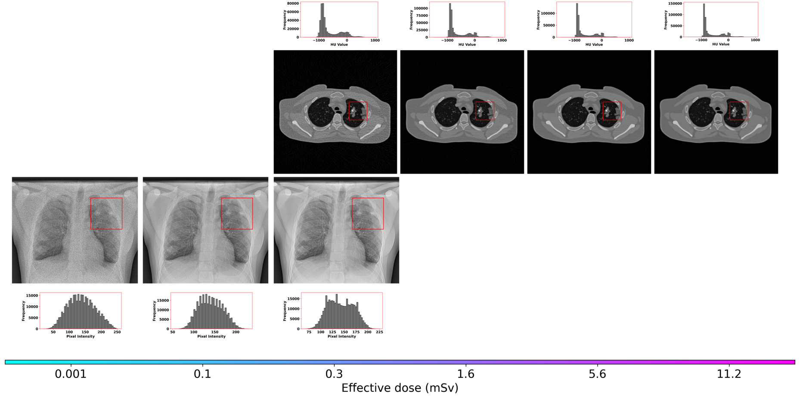
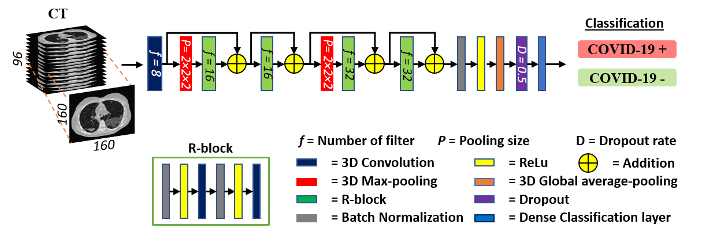

# Reality check: Virtual imaging to validate radiology AI reproducibility and unearth clinical insights – A ReviCOVID-19 case study

Using COVID-19 as a case study, this virtual imaging trial study verified that radiology AI models often
suffer from a reproducibility crisis.

### Citation
```ruby
@article{tushar2023data,
  title={Data diversity and virtual imaging in AI-based diagnosis: A case study based on COVID-19},
  author={Tushar, Fakrul Islam and Dahal, Lavsen and Sotoudeh-Paima, Saman and Abadi, Ehsan and Segars, W Paul and Samei, Ehsan and Lo, Joseph Y},
  journal={arXiv preprint arXiv:2308.09730},
  year={2023}
}
```
```ruby
Tushar, Fakrul Islam, et al. "Data diversity and virtual imaging in AI-based diagnosis: A case study based on COVID-19." arXiv preprint arXiv:2308.09730 (2023).
```


## Datastets

This study ustilized a large cohort of open-access clinical CT and CXR for model developement and evaluation alongside the simulated CT and CXR


A total of 16,949 CT scans of 11,166 patients were used for model development and testing.
There were ten clinical datasets: RICORD, MosMed,BIMCV-COVID-19 +/- (BIMCV-V2),
COVID-CT-MD, CT Images in COVID-19,PleThora, COVID19-CT-dataset, Stony Brook
University COVID-19 Positive Cases (COVID-19-NY-SBU), A Large-Scale CT and PET/CT Dataset
for Lung Cancer Diagnosis (Lungs-CT-Dx), and Lung Image Database Consortium / Image Database
Resource Initiative (LIDC-IDRI). These ten clinical datasets were united into the U-10 CT Dataset.
Additionally, simulated data were from the Center for Virtual Imaging Trials CT Dataset, Duke-CVIT-
CT.





# CT Analysis -- /ct_analysis
### COVID-19 case-level detection using CT

This project, developed by Fakrul Islam Tushar at Duke University, is aimed at classifying COVID-19 cases using the Uniter-10-Dataset. The model utilizes 3D ResNet architecture for efficient and accurate classification.

### Disclaimer

This software is a property of Duke University and is available for non-commercial uses only. While this software is distributed in the hope that it will be useful, it is provided "AS IS" WITHOUT ANY WARRANTY, including the implied warranty of MERCHANTABILITY or FITNESS FOR A PARTICULAR PURPOSE.

## Prerequisites

Before running this project, ensure you have the following:

- Docker container `ft42/cvit:ft42tf26` with all the necessary libraries pre-installed.
- NVIDIA GPU with at least 11 GB of memory (3x11 GB recommended for optimal performance).

## Project Structure- Training

- `Sample_Data/`: Contains the dataset required for training.
  - `mosmed_tfrecords_96x160x160/`: Main data folder.
  - `data_cache/`: Stores cache data during runtime.
- `Logs_And_Weights_StorageFolder/`: Stores model logs and weights.
  - Model weights and logs are saved in designated subfolders.
  - A CSV log file is also generated during training.
- `training_lossweight_calc_csv/`: Contains sample CSV files for weighted loss functions.
- `config.py`: Configuration script to set up model parameters and training settings.
- `train.py`: Main training script.




## Setup

1. Pull the Docker container:
   ```
   docker pull ft42/cvit:ft42tf26
   ```
2. Run the Docker container (example command):
   ```
   nvidia-docker run -it --name=ft42_demorun -v /home/ft42/:/Sharedfolder:z -v /local/usr/ft42/:/local:z -v /image_data/:/image_data:z -v /image_data2/:/image_data2:z -v /data2/:/data2:z -v /data/:/data:z -v /ssd0/:/ssd0:z -v /net_data/:/net_data:z ft42/cvit:ft42tf26
   ```
3. Modify `config.py` to suit your requirements, such as the number of GPUs, batch size, and model capacity.

## Running the Project

To start the training process, execute the following command:

```
python train.py
```

This will initiate the training process, with logs and model weights being saved in the `Logs_And_Weights_StorageFolder`.


Using 3 NVIDIA GPUs with 11 GB each, a batch size of 24, and a mini-batch size of 8, the model takes approximately 15 seconds per epoch.


Based on your deployment JSON configuration and the command provided for inference, I'll draft a README that focuses on the deployment and testing aspects of your project.

---

# Testing Guide for COVID-19 case-level detection using CT

This guide provides instructions for deploying and testing the COVID-19 classification model on the BIMCV dataset using a pre-configured JSON file and a Python script.

## Pre-requisites

Ensure you have the following setup before proceeding:

- Properly configured environment with necessary dependencies installed.
- Access to the specified directories and files as mentioned in the deployment JSON configuration.

## Deployment Configuration

The deployment configuration is provided in a JSON file (`bimcv.json`). Key parameters include:

- `DATASET_TO_RUN_ON`: Specifies the dataset to be used for inference, set to "bimcv".
- `NAME_TO_SAVE`: Name under which the model outputs will be saved.
- `PATH_TO_SAVE_LOGS`: Directory path for saving logs.
- `INFERENCE_MODE`, `COMPUTE_AUC`, `INPUT_FORMAT`: Various settings related to inference and evaluation.
- `RESAMPLING`, `PATCH_SIZE`, `MODEL_PATH`: Parameters related to image preprocessing and the model.

Ensure that the configuration file is correctly set up according to your deployment needs.

## Running Inference

To run the inference, use the following command:

```
python deploy.py --gpu 0 --config deploy_configs/MODEL-bimcv-Dataset-Test-bimcv.json
```

This command specifies the GPU to use (`--gpu 0`) and the path to the configuration file (`--config`).

## Output

The inference script will process the specified dataset and generate outputs according to the configuration. Logs and results will be stored in the directory specified in the `PATH_TO_SAVE_LOGS` parameter.

## Post-Inference Steps

After inference, you may want to:

- Review the logs for any errors or warnings.
- Analyze the output files for model performance, including AUC if `COMPUTE_AUC` is set to "True".
- Compare the results with expected outcomes or benchmarks.

## Troubleshooting

- Ensure all paths in the configuration file are accessible and correct.
- Verify that the model file specified in `MODEL_PATH` exists and is compatible with the deployment script.
- Check GPU availability and utilization if encountering issues related to resource allocation.

For further assistance, please contact the project maintainers or refer to the project documentation.


## CXR Analysis--/cxr_analysis


- `train.py`: training script
- `predict.py`: predict script
- `utils.py`: utility fuctions for the train/validation/predict


## Contact

For any queries or further information, please contact Fakrul Islam Tushar at fakrulislam.tushar@duke.edu.


## License details
